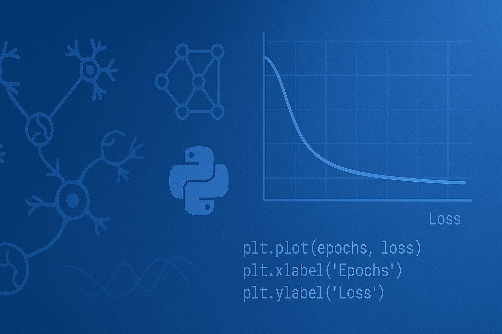

  

---

<h1 align="center">
  Hi, I'm Edgar Andrés Hidalgo Hernández!
  
</h1>

Welcome to my GitHub profile! I am a <strong>Data Scientist and Front‑End Developer</strong> passionate about turning raw data into actionable insights through statistical analysis and machine learning with Python, SQL, and pandas, while also crafting scalable, accessible web applications using React, Next.js, and TypeScript. Below, you’ll find more about my data‑driven projects, my technical skills, and how I blend code and analysis to deliver impactful solutions.

---

### 👨‍💻 About Me
- 🌍 Based in New York, USA.
- 💼 Currently working as a **Freelance**, specializing in data science and data visualization.
- 🌟 Passionate about data visualization, machine learning and web development.

---

### 🛠️ Technical Skills
- **Programming Languages**: Python, JavaScript (ES6+), TypeScript, HTML5, CSS3
- **Data Analysis**: NumPy, pandas, scikit‑learn, LightGBM, CatBoost, XGBoost, PySpark
- **Visualization Tools**: Matplotlib, Seaborn, Plotly, Streamlit, Power BI
- **Front‑end Frameworks & Libraries**: React, Next.js, Styled‑Components, Tailwind CSS
- **Back‑end & Databases**: Node.js, Express.js, RESTful APIs, Firebase, MongoDB, PostgreSQL
- **DevOps & Deployment**: Git & GitHub, CI/CD (GitHub Actions, Vercel, Netlify)
- **Development Tools & Editors**: VS Code
- **Testing & QA**: Jest, React Testing Library

    
    
    
    
    
    
    
    
    
    
    
    
    
    
    
    

---

### 📫 Let's Connect!
- **Email:** andress.hidal1996@gmail.com
- **Cellphone:** +1 917 772 2617
- **LinkedIn:** [linkedin.com/in/andreshidalgo-datascientist](https://www.linkedin.com/in/andreshidalgo-datascientist/)

---
